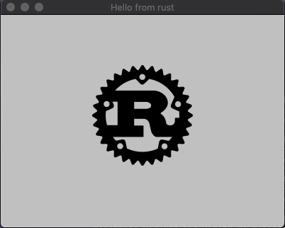
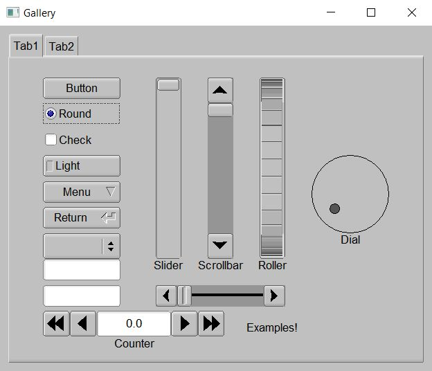
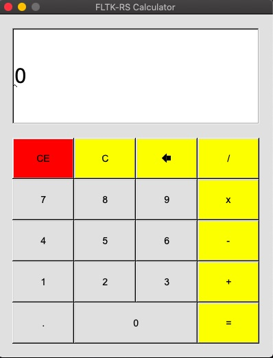
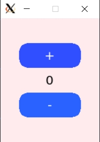
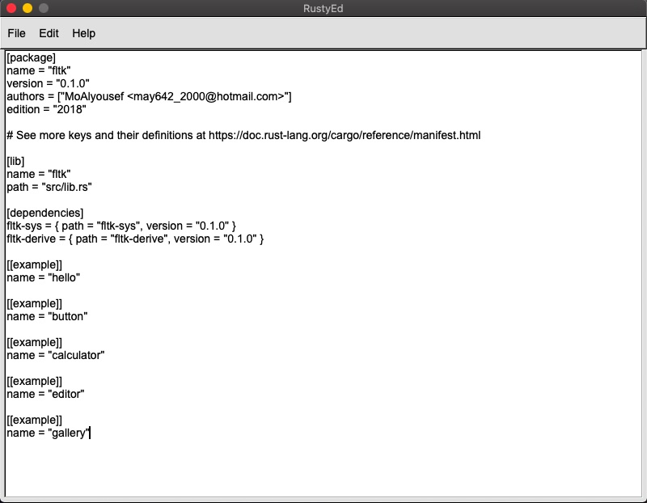
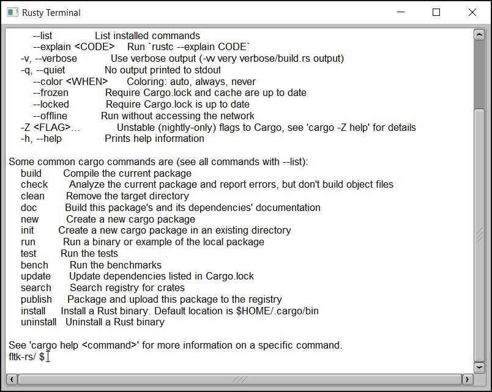
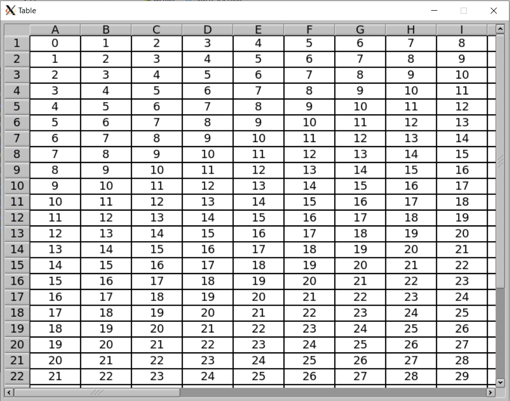
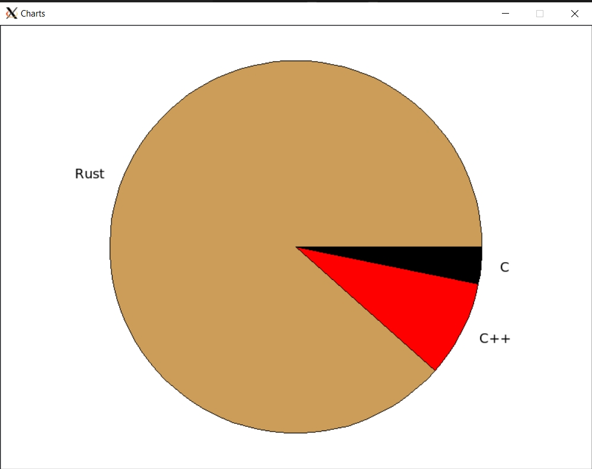
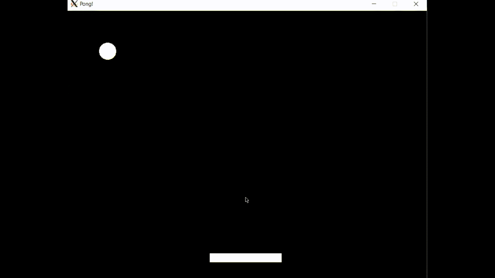
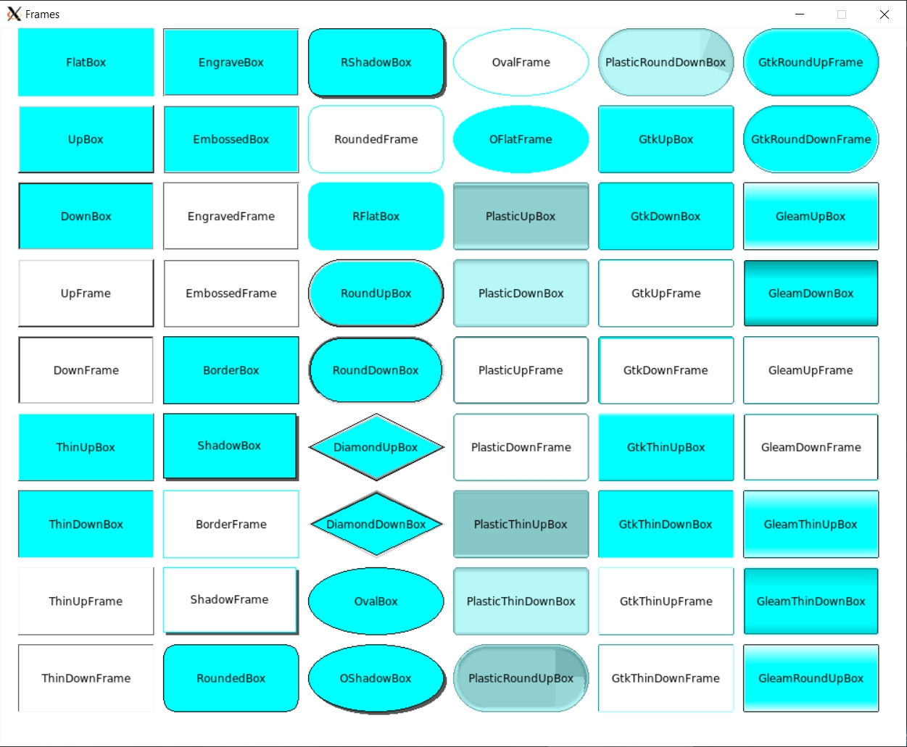

# fltk-rs

[](https://docs.rs/fltk)
[](https://crates.io/crates/fltk)
[](https://github.com/MoAlyousef/fltk-rs/blob/master/LICENSE)
[](https://github.com/MoAlyousef/fltk-rs/actions)


Rust bindings for the FLTK Graphical User Interface library. 

The FLTK crate is a crossplatform lightweight gui library which can be statically linked to produce small, self-contained and fast gui applications.

Tutorials:
- [Video](https://github.com/MoAlyousef/fltk-rs#tutorials)
- [Written](https://github.com/MoAlyousef/fltk-rs/wiki)
- Erco's FLTK cheat [page](http://seriss.com/people/erco/fltk/), which is an excellent FLTK C++ reference. 

Why choose FLTK?
- Lightweight. Small binary, around 1mb after stripping. [Small memory footprint](https://szibele.com/memory-footprint-of-gui-toolkits/).
- Speed. Fast to install, fast to build, fast at startup and fast at runtime. 
- Single executable. No DLLs to deploy.
- Supports old architectures. 
- FLTK's permissive license which allows static linking for closed-source applications.
- Themability (4 supported themes: Base, GTK, Plastic and Gleam).
- Provides around 80 customizable widgets. 
- Has inbuilt image support.

Here is a [list](https://en.wikipedia.org/wiki/FLTK#Use) of software using FLTK.

- [Link](https://github.com/fltk/fltk) to the official FLTK repository.
- [Link](https://www.fltk.org/doc-1.3/index.html) to the official documentation.

## Usage

Just add the following to your project's Cargo.toml file:

```toml
[dependencies]
fltk = "^0.11"
```

The library is automatically built and statically linked to your binary.

For faster builds you can enable ninja builds for the C++ source using the "use-ninja" feature.

An example hello world application:

```rust
use fltk::{app::*, window::*};

fn main() {
    let app = App::default();
    let mut wind = Window::new(100, 100, 400, 300, "Hello from rust");
    wind.end();
    wind.show();
    app.run().unwrap();
}
```

Another example showing the basic callback functionality:
```rust
use fltk::{app::*, button::*, frame::*, window::*};

fn main() {
    let app = App::default();
    let mut wind = Window::new(100, 100, 400, 300, "Hello from rust");
    let mut frame = Frame::new(0, 0, 400, 200, "");
    let mut but = Button::new(160, 210, 80, 40, "Click me!");
    wind.end();
    wind.show();
    but.set_callback(move || frame.set_label("Hello World!"));
    app.run().unwrap();
}
```
Please check the [examples](fltk/examples) directory for more examples.
You will notice that all widgets are instantiated with a new() method, taking the x and y coordinates, the width and height of the widget, as well as a label which can be left blank if needed. Another way to initialize a widget is using the builder pattern: (The following buttons are equivalent)

```rust
let but1 = Button::new(10, 10, 80, 40, "Button 1");

let but2 = Button::default()
    .with_pos(10, 10)
    .with_size(80, 40)
    .with_label("Button 2");
```

An example of a counter showing use of the builder pattern:
```rust
fn main() {
    let app = App::default();
    let mut wind = Window::default()
        .with_size(160, 200)
        .center_screen()
        .with_label("Counter");
    let mut frame = Frame::default()
        .with_size(100, 40)
        .center_of(&wind)
        .with_label("0");
    let mut but_inc = Button::default()
        .size_of(&frame)
        .above_of(&frame, 0)
        .with_label("+");
    let mut but_dec = Button::default()
        .size_of(&frame)
        .below_of(&frame, 0)
        .with_label("-");
    wind.make_resizable(true);
    wind.end();
    wind.show();
    /* Event handling */
}
```

### Events
**Event handling must be done after the drawing is done and the main window shown. And must be done in the main thread**

Events can be handled using the set_callback method (as above) or the available fltk::app::set_callback() free function, which will handle the default trigger of each widget(like clicks for buttons):
```rust
    /* previous hello world code */
    but.set_callback(move || frame.set_label("Hello World!"));
    app.run().unwrap();
```
Another way is to use message passing:
```rust
    /* previous counter code */
    let (s, r) = app::channel::<Message>();

    but_inc.emit(s, Message::Increment);
    but_dec.emit(s, Message::Decrement);
    
    while app.wait() {
        let label: i32 = frame.label().parse().unwrap();
        match r.recv() {
            Some(Message::Increment) => frame.set_label(&(label + 1).to_string()),
            Some(Message::Decrement) => frame.set_label(&(label - 1).to_string()),
            None => (),
        }
    }
```
For the remainder of the code, check the full example [here](fltk/examples/counter2.rs).

For custom event handling, the handle() method can be used:
```rust
    some_widget.handle(move |ev: Event| {
        match ev {
            /* handle ev */
        }
    });
```
Handled or ignored events using the handle method should return true, unhandled events should return false. More examples are available in the fltk/examples directory.

### Theming

FLTK offers 4 application themes (called schemes):
- Base
- Gtk
- Gleam
- Plastic

These can be set using the App::with_scheme() method.
```rust
let app = App::default().with_scheme(AppScheme::Gleam);
```
Themes of individual widgets can be optionally modified using the provided methods in the WidgetExt trait, such as set_color(), set_label_font(), set_frame() etc:
```rust
    some_button.set_color(Color::Light1); // You can use one of the provided colors in the fltk enums
    some_button.set_color(Color::from_rgb(255, 0, 0)); // Or you can specify a color by rgb or hex/u32 value
    some_button.set_color(Color::from_u32(0xffebee));
    some_button.set_frame(FrameType::RoundUpBox);
    some_button.set_font(Font::TimesItalic);
```

## Features

The following are the features offered by the crate:
- use-ninja:  If you have ninja build installed, it builds faster than make or VS
- system-libpng: Uses the system libpng
- system-libjpeg: Uses the system libjpeg
- system-zlib: Uses the system zlib
- fltk-bundled: Support for bundled versions of cfltk and fltk on selected platforms (requires curl and tar)
- no-pango: Build without pango support on Linux/BSD.
- enable-glwindow: Support for drawing using OpenGL functions.

## Dependencies

Rust (version > 1.38), CMake (version > 3.0), Git and a C++11 compiler need to be installed and in your PATH for a crossplatform build from source. This crate also offers a bundled form of fltk on selected platforms, this can be enabled using the fltk-bundled feature flag (which requires curl and tar to download and unpack the bundled libraries). If you have ninja-build installed, you can enable it using the "use-ninja" feature. This should accelerate build times significantly.

- Windows: No dependencies.
- MacOS: No dependencies.
- Linux: X11 and OpenGL development headers need to be installed for development. The libraries themselves are available on linux distros with a graphical user interface.

For Debian-based GUI distributions, that means running:
```
$ sudo apt-get install libx11-dev libxext-dev libxft-dev libxinerama-dev libxcursor-dev libxrender-dev libxfixes-dev libpango1.0-dev libgl1-mesa-dev libglu1-mesa-dev
```
For RHEL-based GUI distributions, that means running:
```
$ sudo yum groupinstall "X Software Development" && yum install pango-devel libXinerama-devel
```
For Arch-based GUI distributions, that means running:
```
$ sudo pacman -S libx11 libxext libxft libxinerama libxcursor libxrender libxfixes pango cairo libgl mesa --needed
```
For Alpine linux:
```
$ apk add pango-dev fontconfig-dev libxinerama-dev libxfixes-dev libxcursor-dev
```
- Android: Android Studio, Android Sdk, Android Ndk.

## FAQ

please check the [FAQ](FAQ.md) page for frequently asked questions, encountered issues, guides on deployment, and contribution.

## Building

To build, just run:
```
$ git clone https://github.com/MoAlyousef/fltk-rs
$ cd fltk-rs
$ cargo build
```

## Examples

To run the examples: 
```
$ cargo run --example editor
$ cargo run --example calculator
$ cargo run --example gallery
$ cargo run --example terminal_colored
$ cargo run --example counter
$ cargo run --example hello
$ cargo run --example hello_button
...
```



Setting the scheme to Gtk:







Check the full [code](fltk/examples/counter.rs) for the custom theming.

Setting the scheme to Gtk:













Different frame types which can be used with many different widgets such as Frame, Button widgets, In/Output widgets...etc.

## Currently implemented types:

### Image types:
- SharedImage
- BmpImage
- JpegImage
- GifImage
- PngImage
- SvgImage
- Pixmap
- RgbImage
- XpmImage
- XbmImage
- PnmImage
- TiledImage

### Widgets:
- Buttons
    - Button
    - RadioButton
    - ToggleButton
    - RoundButton
    - CheckButton
    - LightButton
    - RepeatButton
    - RadioLightButton
    - RadioRoundButton
- Dialogs
    - Native FileDialog
    - FileChooser
    - HelpDialog
    - Message dialog
    - Alert dialog
    - Password dialog
    - Choice dialog
    - Input dialog
    - ColorChooser dialog
- Frame (Fl_Box)
- Windows
    - Window
    - SingleWindow
    - DoubleWindow
    - MenuWindow
    - GlWindow (requires the "enable-glwindow" flag)
- Groups
    - Group
    - Pack
    - Tabs
    - Scroll
    - Tile
    - Wizard
    - ColorChooser
    - VGrind
    - HGrid
- Text display widgets
    - TextDisplay
    - TextEditor
    - SimpleTerminal
- Input widgets
    - Input
    - IntInput
    - FloatInput
    - MultilineInput
    - SecretInput
    - FileInput
- Output widgets
    - Output
    - MultilineOutput
- Menu widgets
    - MenuBar
    - MenuItem
    - Choice (dropdown list)
    - SysMenuBar (MacOS menu bar which appears at the top of the screen)
- Valuator widgets
    - Slider
    - NiceSlider
    - ValueSlider
    - Dial
    - LineDial
    - Counter
    - Scrollbar
    - Roller
    - Adjuster
    - ValueInput
    - ValueOutput
    - FillSlider
    - FillDial
    - HorSlider (Horizontal slider)
    - HorFillSlider
    - HorNiceSlider
    - HorValueSlider
- Browsing widgets
    - Browser
    - SelectBrowser
    - HoldBrowser
    - MultiBrowser
    - FileBrowser
- Miscelaneous widgets
    - Spinner
    - Clock (Round and Square)
    - Chart (several chart types are available)
    - Progress (progress bar)
    - Tooltip
- Table widgets
    - Table
    - TableRow
- Trees
    - Tree
    - TreeItem

### Drawing primitives
(In the draw module)
### Surface types:
- Printer.
- ImageSurface.
- SvgFileSurface.

## Tutorials

- [Basics](https://www.youtube.com/watch?v=ygP4egJtmzw)
- [User input](https://youtu.be/rIq2O4vg9fQ)
- [Client-side web todo app](https://youtu.be/tdfFXi4-Yrw)
- [Create a media player using the vlc crate](https://youtu.be/enxqU3bhCEs)
- [Custom dialogs](https://youtu.be/tXeXHoKG6-I)
- [Add drag and drop to the editor example](https://www.youtube.com/watch?v=qp5hnRvSxAg)
- [Drawing things with fltk](https://www.youtube.com/watch?v=r9MOpvfBPWs)
- [Working with images](https://www.youtube.com/watch?v=Rn2sjfAX4WI)
- [Audio player with custom widgets](https://www.youtube.com/watch?v=okdFx6tv7ds)
- [Using FLTK on Android](https://www.youtube.com/watch?v=3jW_vxGmxt0)

More videos in the playlist [here](https://www.youtube.com/playlist?list=PLHqrrowPLkDu9U-uk60sGM-YWLOJFfLoE).
Some of the demo projects can be found [here](https://github.com/MoAlyousef/fltk-rs-demos).
